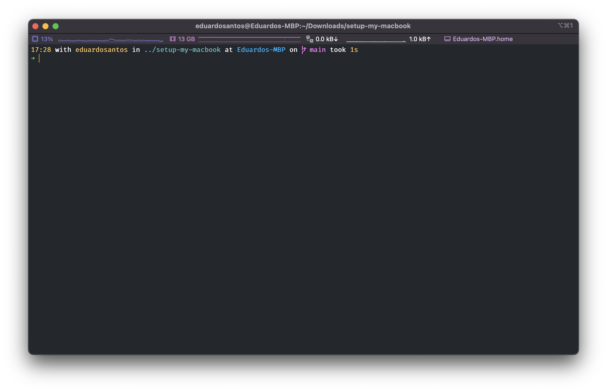
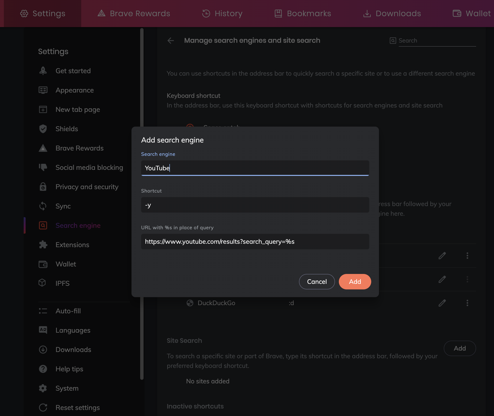
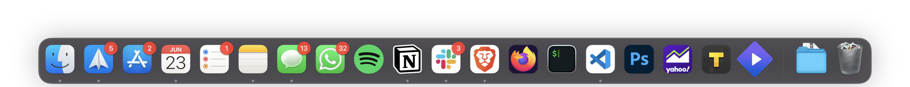

# Setup My MacBook

This repo will be used to configure a MacBook from scratch, it can serve as a guide for a brand new computer or after a factory reset.

ℹ️ [Reset MacBook](https://9to5mac.com/2022/01/10/how-to-factory-reset-your-macbook-and-other-macs/)

## MacBook Specifications

**Model**: MacBook Pro (15-inch, 2017)

**Processor**: 2,8 GHz Quad-Core Intel Core i7

**Memory**: 16 GB 2133 MHz LPDDR3

**Graphics**: Intel HD Graphics 630 1536 MB

## Table of Contents

- macOS Updates
- System Preferences
- Terminal
- Shell
- HomeBrew
- Apps
- Dock
- Touch Bar not working bug

## macOS Updates

When starting your mac for the first time, you should always check if there are any software updates available. You can find these updates by going to `System Preferences > Software Updates`.

## System Preferences

When setting up a mac, there are also some system preferences I like to change.

### General

`System Preferences > General > Appearance > Dark`

`System Preferences > General > Prefer tabs >` **`always`** `when opening documents`

Uncheck `System Preferences > General > Close windows when quitting an app`

`System Preferences > General > Show scroll bars: >` **`When scrolling`**

### Dock & Menu Bar

`System Preferences > Dock & Menu Bar > Double-click a window's title bar to` **`minimize`**

`System Preferences - Dock & Menu Bar - Clock - Show Date` **`Always`**

Uncheck `System Preferences > Dock & Menu Bar > Show recent applications in Dock`

Check `System Preferences > Dock & Menu Bar > Now Playing > Show in Menu Bar`

Check `System Preferences > Dock & Menu Bar > Minimise windows into application icon`

Check `System Preferences > Dock & Menu Bar > Wi-Fi > Show in Menu Bar`

Check `System Preferences > Dock & Menu Bar > Bluetooth > Show in Menu Bar`

Check `System Preferences > Dock & Menu Bar > Sound > Show in Menu Bar` **`always`**

### Mission Control

Check `System Preferences > Mission Control > Group windows by application`

Uncheck `System Preferences > Mission Control > Automatically rearrange Spaces based on most recent used`

**Hot Corners:**

- Left Inferior Corner: **Launchpad**
- Right Inferior Corner: **Lock Screen**

### Displays

`System Preferences > Displays > Resolution >` **`Scaled`**

`System Preferences > Displays > Resolution >` **`More Space`**

### Keyboard

Uncheck `System Preferences > Keyboard > Keyboard > Adjust keyboard brightness in low light`

`System Preferences > Keyboard > Keyboard > Turn keyboard backlight off after` **`1 min`** `of inactivity`

`System Preferences > Keyboard > Keyboard > Press fn key to` **`Show emojis & Symbols`**

`System Preferences > Keyboard > Keyboard > Press and hold fn key to` **`Show F1, F2, etc. Keys`**

Uncheck `System Preferences > Keyboard > Text > Correct spelling automatically`

Uncheck `System Preferences > Keyboard > Text > Capitalize words automatically`

Uncheck `System Preferences > Keyboard > Text > Add period with double-space`

### Trackpad

Check `System Preferences > Trackpad > Point & Click > Look up & data detectors`

Check `System Preferences > Trackpad > Point & Click > Secondary click`

Check `System Preferences > Trackpad > Point & Click > Tap to click`

**More Gestures**

Uncheck **only** `System Preferences > Trackpad > More Gestures > Launchpad`

### Security & Privacy

`System Preferences > Security & Privacy > General > Require password after` **`5 seconds`** `after sleep or screen saver begins`

`System Preferences > Security & Privacy > Firewall >` **`Turn On Firewall`**

### Finder

`Preferences > General > New Finder windows show >` **`Documents`**

Check `Preferences > General >` **`Open folders in tabs instead of new windows`**

Check `Preferences > Advanced >` **`Show all filename extensions`**

`Preferences > Advanced > When performing a search >` **`Search the Current Folder`**

Show/Hide hidden files in folders: `Command + Shift + .`

## Mac Commands and Shortcuts

On the Mac, the "command" key (⌘) replaces the "ctrl" key in Windows. Here are the main combinations that I use:
* @: Option + 2
* Change current app: CMD + Tab
* Change tab: CMD + Option + Left/Right Arrow
* Clear cache: CMD + Shift + R
* Close app: CMD + Q
* Close window: Shift + CMD + W
* Enter full screen mode: Control + CMD + F
* Force quit app: CMD + Option + Esc (use only when an app doesn't respond)
* Go forward/backward word by word: Option + Left/Right Arrow
* Go to the beginning/end of a line: CMD + Left/Right Arrow
* Hide app: CMD + H
* Minimize app: CMD + M
* New tab: CMD + T
* New window: CMD + N
* {}: Shift + Option + 8/9
* (): Shift + 8/9
* Spotlight Search (currently I'm using Alfred 5 as a replacement): CMD + Space bar
* Take Screenshot: CMD + Shift + 5

## Terminal

### Setup Script

My setup.sh file can be found at this repo, running the script will:

- Install HomeBrew
- Install brew formul*æ*s and casks that I use
- Configure Git
- Installing Oh My Zsh
- Create a SSH key to be added to GitHub and add it to the Mac’s Keychain

### iTerm2



**Color presets**

I am currently using the [BlulocoDark](https://raw.githubusercontent.com/mbadolato/iTerm2-Color-Schemes/master/schemes/BlulocoDark.itermcolors) color preset.

**Configurations**

- Enable usage of `option + command + left/right` or `command + left/right` keyboard shortcuts: `Preferences > Profiles > Keys > Key Mappings > Presets >` **`Natural Text Editing`**
- Check `Preferences > Profiles > Session > status bar enabled`
- `Preferences > Profiles > Terminal > Scrollback lines:` **`4000`**
- `Preferences > General > Terminal > Startup > Window restauration policy:` **`Use System Window Restauration Setting`**
- `Preferences > Profiles > General > Working Directory >` **`Reuse previous session's directory`**
- `Preferences > Profiles > Text > Cursor >` **`Vertical bar`**

### Font

The font I use is **Fira Code**.

## Shell

### ****Oh My Zsh****

[Oh My Zsh](https://ohmyz.sh/) is an open source, community-driven framework for managing your Zsh configuration.

### .zshrc

My .zshrc file can be found [here](https://github.com/eduardosantoshf/my-configs-and-dotfiles/blob/main/dotfiles/.zshrc). To edit the zsh config file, run:

```bash
vim ~/.zshrc
```

### .vimrc

My .vimrc file can be found [here](https://github.com/eduardosantoshf/my-configs-and-dotfiles/blob/main/dotfiles/.vimrc). In alternative, this is the file content:

```bash
syntax on
set hlsearch
```

To edit the vim config file, run:

```bash
vim ~/.vimrc
```

### ****Zsh**** Spaceship prompt

[Spaceship](https://github.com/spaceship-prompt/spaceship-prompt) is a minimalistic, powerful and extremely customizable [Zsh](http://zsh.org/) prompt. It combines everything you may need for convenient work, without unnecessary complications, like a real spaceship.

### Auto Suggestions Zsh Plugin

****[zsh-autosuggestions](https://github.com/zsh-users/zsh-autosuggestions)****

## HomeBrew

[HomeBrew](https://brew.sh/) is a free and open-source software package management system that simplifies the installation of software on Apple's operating system, macOS, as well as Linux. 

Before you install HomeBrew though you need to install the xcode command line utilities:

```bash
xcode-select --install
```

We can then install brew with:

```bash
/bin/bash -c "$(curl -fsSL https://raw.githubusercontent.com/Homebrew/install/HEAD/install.sh)"
```

### Brew

Here are some of the brew formul*æ*s that I have (more to be added):

- git
- htop
- wget
- curl
- telnet
- tree
- trash
- pdfgrep
- make

### Brew Cask

- visual-studio-code
- brave-browser
- docker
- rectangle
- postman
- notion
- iterm2
- firefox
- discord
- the-unarchiver
- vlc
- tg-pro
- webtorrent
- spotify
- teamviewer
- caffeine
- stats
- alfred
- stremio
- kap
- maccy
- iina

## Apps

These are the apps that I have currently installed on my mac. Whenever I can, I will install these apps from HomeBrew.

- [Endpoint Security VPN](https://supportcenter.checkpoint.com/supportcenter/portal/user/anon/page/default.psml/media-type/html?action=portlets.DCFileAction&eventSubmit_doGetdcdetails=&fileid=123070)
- Spotify
- CleanMyMac X
- Todoist
- Speedtest
- Adobe Photoshop 2021
- Slack
- The Unarchiver
- Visual Studio Code
- Twitter
- Discord
- Messenger
- iTerm2
- Parcel
- TeamViewer
- Office (Word, PowerPoint, Excel) - honestly, google docs serves perfectly, not installing those anymore
- Microsoft Teams (infelizmente)
- Brave Browser
- Postman
- Zoom
- Autenticação.gov
- WhatsApp
- VLC
- Docker
- MusicHarbor
- Rectangle
- ClickUp
- TG Pro (control fans)
- Spark
- OneDrive
- Bitwarden
- IntelliJ IDEA
- WebTorrent
- Firefox
- Codye
- Cent
- Notion
- DevToys
- Todoist

### Brave

⚠️ To access certain websites functionalities (ex. Streaming services), it's necessary to deactivate Brave shields on that websites.

**Extensions**

Here are the chromium extensions that I use:

[AutoHideDownloadsBar](https://chrome.google.com/webstore/detail/autohidedownloadsbar/gkmndgjgpolmikgnipipfekglbbgjcel/related)

[Katalon Recorder (Selenium tests generator)](https://chrome.google.com/webstore/detail/katalon-recorder-selenium/ljdobmomdgdljniojadhoplhkpialdid)

[FireShot](https://chrome.google.com/webstore/detail/take-webpage-screenshots/mcbpblocgmgfnpjjppndjkmgjaogfceg)

[Dark Reader](https://chrome.google.com/webstore/detail/dark-reader/eimadpbcbfnmbkopoojfekhnkhdbieeh)

[Teleparty](https://chrome.google.com/webstore/detail/netflix-party-is-now-tele/oocalimimngaihdkbihfgmpkcpnmlaoa)

**Search Engine Shortcuts**



### VS Code

**Extensions**

- [Live-Share](https://marketplace.visualstudio.com/items?itemName=MS-vsliveshare.vsliveshare)
- [Dracula Official](https://marketplace.visualstudio.com/items?itemName=dracula-theme.theme-dracula) (theme)
- [GitHub Theme](https://marketplace.visualstudio.com/items?itemName=GitHub.github-vscode-theme) (theme)
- [Palenight Theme](https://marketplace.visualstudio.com/items?itemName=whizkydee.material-palenight-theme) (theme)
- [Docker](https://marketplace.visualstudio.com/items?itemName=ms-azuretools.vscode-docker)
- [Remote - SSH](https://marketplace.visualstudio.com/items?itemName=ms-vscode-remote.remote-ssh)
- [vscode-pdf](https://marketplace.visualstudio.com/items?itemName=tomoki1207.pdf)
- [Todo Tree](https://marketplace.visualstudio.com/items?itemName=Gruntfuggly.todo-tree)
- [GitLens](https://marketplace.visualstudio.com/items?itemName=eamodio.gitlens)
- [Error Lens](https://marketplace.visualstudio.com/items?itemName=usernamehw.errorlens)
- [Draw.io Integration](https://marketplace.visualstudio.com/items?itemName=hediet.vscode-drawio)

**Color Theme**

Currently using **Github Dark Dimmed** color theme.

### Clean My Mac X

I use [CleanMyMac X](https://macpaw.com/cleanmymac) to (ironically) clean my mac from time to time. It is a good app uninstaller as well.

## Dock



## Touch Bar not working bug

Sometimes, if the touch bar stops working, restarting it may solve the problem:

	sudo pkill TouchBarServer
